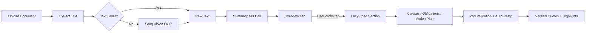

<div align="center">

# ⚖️ ClearPaper

**Understand what you sign.**

*Jo likha hai, wahi samjho.*

[](https://nextjs.org/)
[](https://www.typescriptlang.org/)
[](https://groq.com/)
[](./tests/)
[](https://cloud.google.com/run)
[](./LICENSE)

---

**ClearPaper** is an AI-powered legal document analysis platform that translates dense legal jargon into plain-language explanations. Upload any contract — rental agreement, employment offer, freelance MSA, NDA — and get an instant clause-by-clause risk breakdown, obligation extraction, actionable recommendations, and a grounded Q&A chat.

[🚀 Live Demo](https://clearpaper-app-713902466386.us-central1.run.app) · [📄 Report Bug](https://github.com/lazykaizer/promptwar-exclusive-clearpaper/issues) · [💡 Request Feature](https://github.com/lazykaizer/promptwar-exclusive-clearpaper/issues)

</div>

---

## ✨ Key Features

| Feature | Description |
|---|---|
| 📋 **Plain-Language Summary** | Translates complex legal text into an 8th-grade reading level overview |
| 🔍 **Clause-by-Clause Analysis** | Extracts every critical clause with risk ratings (High / Medium / Low) |
| 📌 **Obligation Extraction** | Identifies deadlines, money items, and party-specific obligations |
| 🎯 **Action Plan** | Red flags, missing protections, negotiation points, and a pre-sign checklist |
| 💬 **Grounded Chat** | Ask questions about the document with cited, verified answers |
| ⚖️ **Document Comparison** | Side-by-side diff and verdict between two document versions |
| 🔎 **Smart Search & Auto-Scroll** | Click any extracted clause → auto-scrolls and highlights it in the original text |
| 🌐 **Multilingual** | Supports English, Hindi, Hinglish, Marathi, Gujarati, Bengali, Tamil, Telugu, Kannada |
| 🛡️ **Privacy-First** | No data stored. Refresh = clean slate. Zero persistence by design |

---

## 🏗️ Tech Stack

```
Frontend        → Next.js 16 (App Router) · React 19 · Zustand · Framer Motion
AI Engine       → Groq Fast Inference (Llama 3.2 90B) · Vision OCR
Validation      → Zod Schemas · Auto-Retry JSON Correction Loop
Extraction      → unpdf (text-layer) · Mammoth (DOCX) · Groq Vision (scanned OCR)
Styling         → CSS Variables Design System · Responsive · Dark Mode Ready
Testing         → Vitest (19 unit tests across 5 suites)
Deployment      → Docker → Google Cloud Run (us-central1)
Security        → HSTS · CSP · X-Frame-Options · Rate Limiting · Input Sanitization
```

---

## 🚀 Quick Start

### Prerequisites

- **Node.js** ≥ 18
- **npm** ≥ 9
- A **Groq API Key** → [Get one free](https://console.groq.com/)

### Installation

```bash
# Clone the repository
git clone https://github.com/lazykaizer/promptwar-exclusive-clearpaper.git
cd promptwar-exclusive-clearpaper

# Install dependencies
npm install

# Configure environment
cp .env.example .env.local
```

Edit `.env.local` with your credentials:

```env
GROQ_API_KEY=gsk_your_api_key_here
```

```bash
# Start development server
npm run dev
```

Open [http://localhost:3000](http://localhost:3000) and upload a legal document to get started.

---

## 🧪 Testing

```bash
npm run test        # Run all 19 unit tests
npm run typecheck   # TypeScript strict mode check
npm run lint        # ESLint static analysis
npm run build       # Production build verification
```

**Test Coverage:**

| Suite | Tests | What It Covers |
|---|---|---|
| `verify.test.ts` | 10 | Quote verification, fuzzy matching, prompt injection defense |
| `store.test.ts` | 3 | Zustand state management (extraction, sections, chat) |
| `schemas.test.ts` | 2 | Zod schema validation for API requests |
| `extract.test.ts` | 3 | Text normalization pipeline |
| `rate-limit.test.ts` | 1 | IP-based rate limiting logic |

---

## ☁️ Deployment (Google Cloud Run)

### One-Command Deploy

```bash
gcloud run deploy clearpaper-app \
  --source . \
  --project YOUR_PROJECT_ID \
  --region us-central1 \
  --allow-unauthenticated \
  --quiet
```

> **Note:** Set environment variables via `.env.production` or Cloud Run's environment configuration panel.

---

## 📁 Project Architecture

```
clearpaper/
├── src/
│   └── app/
│       ├── page.tsx                  # Landing page
│       ├── workspace/page.tsx        # Main analysis workspace
│       ├── compare/page.tsx          # Document comparison view
│       └── api/
│           ├── analyze/route.ts      # Summary, clauses, obligations, action plan
│           ├── chat/route.ts         # Grounded Q&A endpoint
│           ├── compare/route.ts      # Side-by-side comparison
│           ├── extract/route.ts      # Document text extraction
│           └── health/route.ts       # Health check for Cloud Run
├── lib/
│   ├── ai/
│   │   ├── client.ts                # Groq API client initialization
│   │   ├── prompts.ts               # System prompt builders per section
│   │   └── run.ts                   # AI orchestrator with retry + JSON validation
│   ├── schemas.ts                   # Zod schemas (Summary, Clauses, Obligations, etc.)
│   ├── extract.ts                   # PDF/DOCX/Image extraction pipeline
│   ├── verify.ts                    # Quote verification against source text
│   ├── rate-limit.ts                # IP-based rate limiter
│   └── env.ts                       # Environment variable validation
├── components/
│   ├── document/DocumentViewer.tsx   # Interactive text viewer with highlights
│   ├── insights/                    # OverviewTab, ClausesTab, ObligationsTab, etc.
│   ├── intake/                      # DropZone, PasteBox, ContextSelectors
│   └── layout/                      # TopBar, DisclaimerBar
├── store/
│   └── useStore.ts                  # Zustand global state (document + compare)
├── tests/                           # Vitest unit test suites
├── samples/                         # Sample legal documents for demo
├── Dockerfile                       # Production container configuration
└── next.config.ts                   # Next.js config with security headers
```

---

## 🧠 How the AI Pipeline Works



1. **Upload** → PDF text-layer extraction via `unpdf`, DOCX via `mammoth`, or fallback to Groq Vision OCR for scanned documents.
2. **Analyze** → Only the Summary is fetched on upload. Clauses, Obligations, and Action Plan are **lazy-loaded on tab click** to minimize API usage.
3. **Validate** → Every AI response passes through Zod schema validation. Malformed JSON triggers an automatic retry loop (up to 3 attempts).
4. **Verify** → Extracted quotes are verified against the original document text with fuzzy matching. Only verified quotes get highlight anchors.

---

## 🔒 Security Measures

| Layer | Implementation |
|---|---|
| **Transport** | HSTS with 2-year max-age, includeSubDomains, preload |
| **Content** | Strict CSP — only `self` and `api.groq.com` allowed |
| **Framing** | `X-Frame-Options: DENY` — prevents clickjacking |
| **Rate Limiting** | Per-IP limits (20/min, 60/hour) to prevent abuse |
| **Input Validation** | All API inputs validated via Zod schemas before processing |
| **No Persistence** | Zero data storage — no cookies, no localStorage, no database |
| **Referrer Policy** | `strict-origin-when-cross-origin` |

---

## 🎨 Design Decisions

| Decision | Rationale |
|---|---|
| **Groq over cloud LLMs** | Sub-second inference latency for real-time UX |
| **Lazy-loading sections** | Reduces API calls by 60-70% — only fetch what the user views |
| **Zustand over Redux** | Minimal boilerplate, easy session reset, zero persistence by design |
| **Server-side quote verification** | AI quotes are verified against source text before reaching the client |
| **Dynamic imports** | Heavy components load on demand via `next/dynamic` — faster initial paint |
| **CSS Variables design system** | Theme-able, no utility class bloat, easy dark mode extension |
| **Browser print for PDF** | Avoids heavy PDF library dependency — works everywhere |

---

## ⚠️ Known Limitations

- Rate limiting is per-instance (each Cloud Run instance has its own counter)
- Scanned document OCR quality depends on image clarity and resolution
- Analysis quality varies with document complexity and language
- No persistent storage — refreshing the page clears all analysis data

---

## 📝 Environment Variables

| Variable | Description | Required |
|---|---|---|
| `GROQ_API_KEY` | Groq API key for AI inference | **Yes** |
| `RATE_LIMIT_PER_MIN` | Max requests per IP per minute (default: `20`) | No |
| `RATE_LIMIT_PER_HOUR` | Max requests per IP per hour (default: `60`) | No |

---

## 🤝 Contributing

Contributions are welcome! Please feel free to submit a Pull Request.

1. Fork the repository
2. Create your feature branch (`git checkout -b feature/amazing-feature`)
3. Commit your changes (`git commit -m 'feat: add amazing feature'`)
4. Push to the branch (`git push origin feature/amazing-feature`)
5. Open a Pull Request

---

## 📄 License

This project is licensed under the MIT License. See the [LICENSE](./LICENSE) file for details.

---

<div align="center">

**Built with ❤️ for the PromptWar Hackathon**

*Making legal documents accessible to everyone.*

</div>
